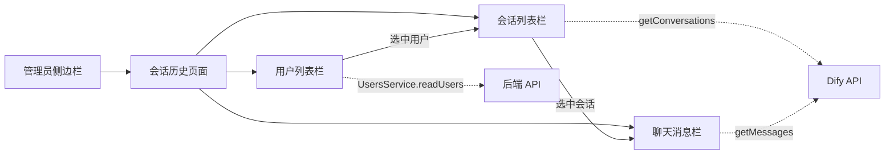

## Product Overview

在管理员后台新增"会话历史管理"页面，管理员可以浏览所有用户的 Dify 对话历史记录。

## Core Features

- 三栏布局：用户列表栏（左）、会话列表栏（中）、聊天消息展示栏（右）
- 左栏：显示所有注册用户列表，支持搜索过滤，排除管理员用户
- 中栏：选中用户后展示该用户的 Dify 会话列表，显示会话名称和时间
- 右栏：选中会话后展示该会话的完整聊天记录（用户消息 + AI 回复），按时间顺序排列
- 侧边栏新增"会话历史"导航菜单项

## Tech Stack

- 前端框架：React + TypeScript（TanStack Router 文件路由）
- UI 组件：shadcn/ui（Card, Button, Badge, Avatar, ScrollArea, Input, Separator）
- 图标：lucide-react
- 样式：Tailwind CSS
- 数据获取：TanStack React Query（useQuery）+ UsersService（用户列表）+ difyApi（会话/消息）
- 架构：现有管理员布局 `_admin-layout.tsx` + Outlet

## Implementation Approach

采用**纯前端方案**，不修改后端。管理员页面通过已有 API 获取数据：

1. `UsersService.readUsers()` 获取全量用户列表（已有接口，超管权限）
2. `getConversations(userId)` 获取指定用户的 Dify 会话列表（已有前端 difyApi）
3. `getMessages(userId, conversationId)` 获取指定会话的聊天消息（已有前端 difyApi）

页面采用单文件组件实现三栏布局，内部用 `useState` 管理选中用户和选中会话状态。数据获取使用 `useQuery` 实现缓存和自动刷新。

## Architecture Design



## Directory Structure

```
full-stack-fastapi-template/frontend/src/
├── routes/
│   └── _admin-layout/
│       └── chat-history.tsx        # [NEW] 会话历史管理页面路由，三栏布局，获取用户/会话/消息数据并渲染
├── components/
│   └── Sidebar/
│       └── AppSidebar.tsx           # [MODIFY] adminItems 新增"会话历史"菜单项，路径为 /admin/chat-history
├── services/
│   └── difyApi.ts                   # 无需修改，已有 getConversations 和 getMessages 接口直接复用
```

## Implementation Notes

- `AppSidebar.tsx` 当前 `user-manage` 路径有 bug（应为 `/admin/users`），新增菜单项时一并修复
- 三栏布局比例建议：左栏 `w-56`、中栏 `w-64`、右栏 `flex-1`，使用 `overflow-hidden` + `overflow-y-auto` 控制滚动
- 用户列表排除 `is_superuser=true` 的管理员用户，只展示普通用户
- 会话列表和消息列表使用 `useQuery` + `enabled` 参数，仅当用户/会话被选中时才发起请求，避免不必要的 API 调用
- 消息展示区分 user/assistant 角色，复用 ai-doctor.tsx 的气泡样式模式
- 时间戳格式化使用 `new Date(timestamp * 1000).toLocaleString("zh-CN")`
- Dify API 使用用户 UUID 作为 `user` 参数，直接从 `UserPublic.id` 获取

## Design Style

管理员后台页面，采用与现有用户管理页面一致的简洁企业风格。三栏布局，每栏有独立标题区域和可滚动内容区域。使用 shadcn/ui 组件保持视觉一致性。

## Page Design

### Page Structure

三栏水平布局，页面标题"会话历史管理"在页面顶部，三栏在下方水平排列。

### Block 1: Page Header

页面标题"会话历史管理"和描述文字"查看和管理所有用户的对话历史记录"，与用户管理页面保持一致的标题样式。

### Block 2: User List Panel (Left Column - w-56)

- 顶部标题"用户列表"和用户数量 Badge
- 搜索 Input 框，支持按姓名/邮箱过滤
- 可滚动用户列表，每项显示头像（姓名首字母）、姓名、邮箱
- 选中状态高亮，鼠标悬停效果

### Block 3: Conversation List Panel (Middle Column - w-64)

- 顶部标题"会话记录"和会话数量 Badge，显示当前选中用户名
- 可滚动会话列表，每项显示会话名称、创建时间
- 选中状态高亮，鼠标悬停效果
- 未选中用户时显示空状态提示

### Block 4: Chat Messages Panel (Right Column - flex-1)

- 顶部显示会话名称和创建时间
- 聊天气泡区域，用户消息靠右蓝色，AI 回复靠左灰色
- 每条消息显示角色标签和时间
- 未选中会话时显示空状态提示"请选择一个会话查看详情"
- 底部自动滚动到最新消息

## Agent Extensions

### SubAgent

- **code-explorer**
- Purpose: 探索现有管理员页面代码模式（用户管理页面、侧边栏组件），确保新页面与现有代码风格一致
- Expected outcome: 获取完整的组件使用模式、样式约定和数据获取方式