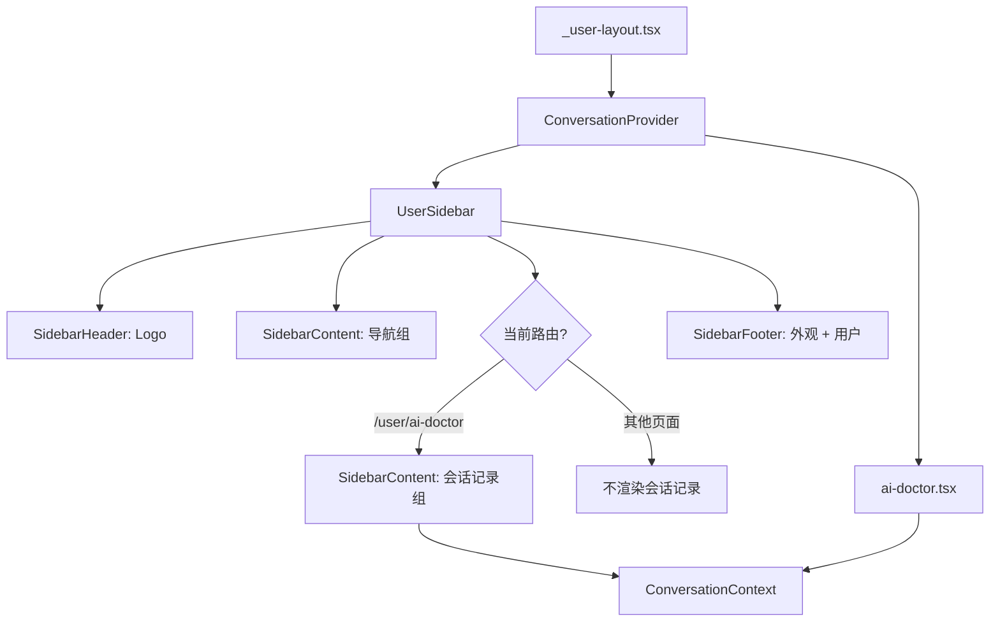

## 产品概述

将 ai-doctor 页面自带的会话列表侧边栏与主侧边栏（UserSidebar）合并为一个统一的侧边栏，消除双重侧边栏问题。

## 核心功能

- 统一侧边栏从上到下分为四个区域：顶栏（Logo）→ 页面跳转栏（导航菜单）→ 会话记录栏（仅 ai-doctor 页面显示）→ 底栏（外观切换 + 用户信息）
- 会话记录栏包含：新建会话按钮、会话列表（选择/删除）、折叠时显示会话数量 badge
- 从 ai-doctor.tsx 中移除独立的会话列表侧边栏，仅保留聊天主区域
- 会话数据通过 Context 在 UserSidebar 和 ai-doctor 页面之间共享

## 视觉效果

- 侧边栏整体使用 shadcn Sidebar 组件，风格与现有导航一致
- 会话记录区域使用 SidebarGroupLabel（标题 "会话记录"）+ SidebarGroupAction（新建按钮）+ SidebarMenu（会话列表）布局
- 侧边栏折叠为 icon 模式时，会话记录区域隐藏，与现有 collapsible=icon 行为一致

## 技术栈

沿用现有技术栈：React + TypeScript + TanStack Router + Tailwind CSS + shadcn/ui (Sidebar 组件族)

## 实现方案

### 核心策略：Context 共享 + 条件渲染

**会话状态管理**：新建 `ConversationContext`，将会话相关的状态（conversations、activeConvId）和操作（loadConversations、selectConversation、deleteConversation、newConversation）提升到 Context 层。在 `_user-layout.tsx` 中提供 Provider，UserSidebar 和 ai-doctor 均通过 Context 消费数据。

**条件渲染**：UserSidebar 通过 `useRouterState()` 获取当前路由，仅在 `pathname === "/user/ai-doctor"` 时渲染会话记录 SidebarGroup。

**ai-doctor 精简**：移除 ai-doctor.tsx 中的会话列表侧边栏代码、`showConvList` 状态、`convListRef`，以及顶栏中的会话数量按钮。保留纯聊天区域。

### 架构设计



### 组件交互

1. `ConversationProvider` 持有所有会话状态，挂在 `_user-layout.tsx` 的 Outlet 外层
2. `UserSidebar` 在 SidebarContent 中根据路由条件渲染 `ConversationList` 组件
3. `ConversationList` 使用 `SidebarGroup` + `SidebarGroupLabel` + `SidebarGroupAction`(Plus按钮) + `SidebarMenu` + `SidebarMenuButton` + `SidebarMenuAction`(删除按钮)
4. `ai-doctor.tsx` 通过 `useConversation()` 获取 activeConvId、selectConversation、newConversation 等，不再自行管理会话列表

## 实现注意事项

- **SidebarGroupAction** 位于 group label 右侧（绝对定位），适合放新建会话的 Plus 图标按钮
- **SidebarMenuAction** 位于 menu item 右侧，设置 `showOnHover` 可实现 hover 才显示删除按钮
- **collapsible=icon 模式**：`SidebarGroupLabel` 和 `SidebarGroupAction` 均有 `group-data-[collapsible=icon]` 样式（隐藏/透明），无需额外处理
- **useRouterState** 已在 `Main.tsx` 中使用，模式一致
- **UserSidebar 需要新增导入**：`useRouterState` from TanStack Router，ConversationContext 及其 hook

## 目录结构

```
full-stack-fastapi-template/frontend/src/
├── routes/
│   ├── _user-layout.tsx              # [MODIFY] 包裹 ConversationProvider
│   └── _user-layout/
│       └── ai-doctor.tsx             # [MODIFY] 移除会话列表侧边栏，使用 ConversationContext
├── components/
│   ├── Sidebar/
│   │   ├── UserSidebar.tsx           # [MODIFY] 条件渲染会话记录组
│   │   └── ConversationList.tsx      # [NEW] 会话记录列表组件
│   └── contexts/
│       └── ConversationContext.tsx    # [NEW] 会话状态 Context + Provider + hook
```